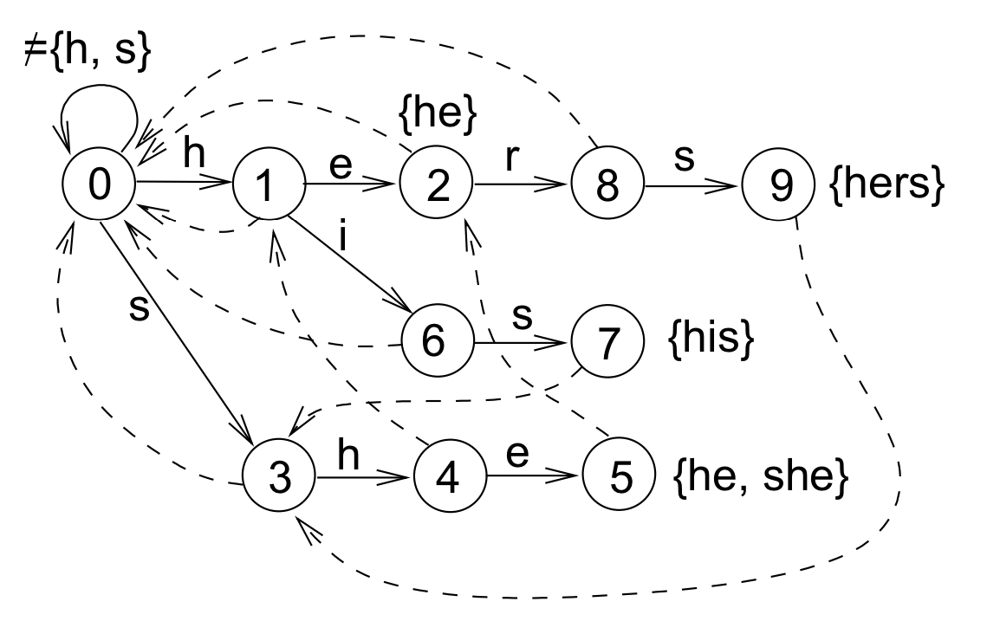

# Aho-Corasick Automaton

Primarily based on [these notes](http://www.cs.uku.fi/~kilpelai/BSA05/lectures/slides04.pdf) from the University of Kuopio, Finland.

Given a set of patterns (the dictionary) and an alphabet of valid symbols, this produces an automaton used to match any pattern in the dictionary against an input sequence of symbols. Each symbol of the input string must be in the alphabet.

I like to think of it as a mixture of [KMP failure function method](https://en.wikipedia.org/wiki/Knuth%E2%80%93Morris%E2%80%93Pratt_algorithm) and [DFA String matching](https://en.wikipedia.org/wiki/String_searching_algorithm#Finite_state_automaton_based_search), but now extended to a set of symbols rather than one specific symbol.

Failure functions now have the option to fail to a state across the tree, creating a cross-edge rather than only failing to previous states in the current word being matched.

## Running Time
Let n denote the sum of |p| for each pattern p in our dictionary.
Let k denote the amount of symbols in our alphabet.

### Construction
* Phase 1 : Adding patterns to the keyowrd trie is O(|p|) for each pattern, thus O(n) overall.
* Phase 2 : Adding gotos for the root node takes O(k)
* Phase 3 : Building the failure states takes O(n) time for the BFS because we must visit each node in our automaton. Failure states, for all patterns (not for each), are followed &le; n times. Overall this pahse is O(n).

### Searching a Text
Let m denote the amount of symbols in our text to search.
At each step we can either follow a failure state or go to a child node. The amount of times we follow a failure state plus the amount of times we proceed to a child is O(m).

Overall, for construction and searchig, it takes O(m + n + k).

## Testing
My implementation is currently being applied to word searches, a somewhat practical use. To test simply
```
javac *.java
cat tests/in0 | java Solution
```
Currently, doesn't return the index of the word matched, but that would be easy enough to implement if the grid iterator were changed.

You can also print out the automaton using it's `toString()` method.


## Example
Example below based on the dictionary: {he, his, hers, she}

Bold edges represent children (paths to follow when matching).

Dotted edges represent failure states (paths to follow when match fails).

[citation](http://www.cs.uku.fi/~kilpelai/BSA05/lectures/slides04.pdf)
